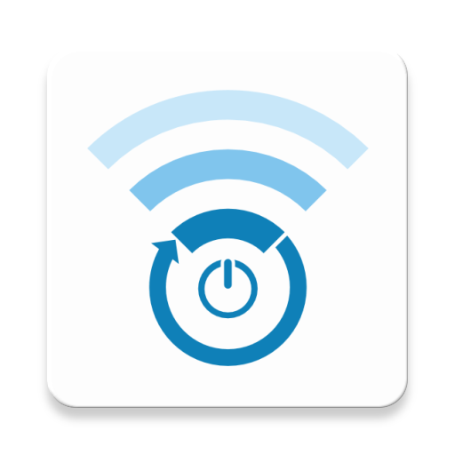

# Wi-Fi Auto

This Android app helps you to save battery power by enabling/disabling Wi-Fi automatically.

## Download this app

This app is [available on the Google Play Store](https://play.google.com/store/apps/details?id=fr.alexandreroman.wifiauto&utm_source=github) for free (no ads).

> Google Play and the Google Play logo are trademarks of Google LLC.

## Contribute

Contributions are always welcome!
Feel free to open issues & send PR.

## License

Copyright &copy; 2018 Alexandre Roman.

This project is licensed under the [Apache Software License version 2.0](https://www.apache.org/licenses/LICENSE-2.0).

Icon kindly donated by [Famil Qasimo](https://github.com/familqasimov).
